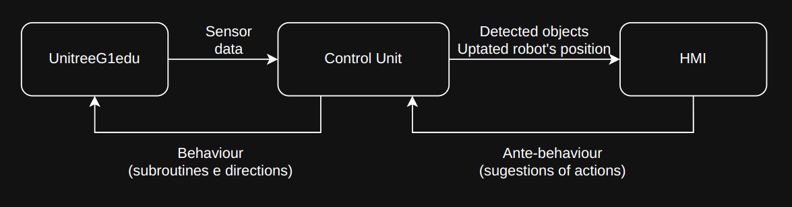

# Controlling the UnitreeG1edu

General objective: make a viable product that can interact with its surroundings in order to serve as a patrol device.

Precise objective: control a UnitreeG1edu device on an enclosed enviroment, with well behaved floors and walls, with a limited supply os obstacles to be catalogued, avoided and interacted with.

---

Requirements of the project

- To make a human machine interface (HMI) in order to have control of the robot's general behaviour, as well as monitor its state. 

- Compute all data on-site, as in oposition of sending data outside of the facility in which the device is on.

- Make it robust to outside perturbations.

## Information flow and control machinary

### General information flow

In the image, the Control Unit stands for a device that is capable of running the calculations of the robot's control.

The HMI part is solely the interface in which the overseer of the robot inputs their desire of behaviour and monitors the present and projected future states of the robot, as well as the layer of methods used to project paths and update the locations on obstacles.

### Deeper dive in the control unit

Tere are two distinct parts on the control unit: deciding the behaviour and recognizing objects around the robot.

#### Deciding behaviour

[write on that as well]

#### Recognizing objects

[write about segmentation + optical flow for optimization]